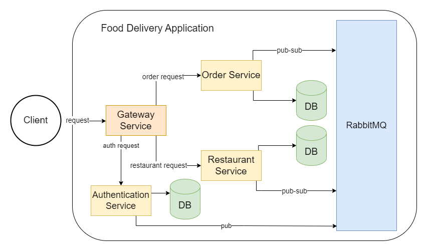

# Microservices Architecture Project

## Food Delivery Application Project

### This simple food delivery back-end application was created to apply my recently acquired knowledge of microservices architecture and showcase some good development practices, such as DRY principle, Testing Pyramid and Continuous Integration.

## 1. Prerequisites

### Before you continue, make sure you have installed:
- latest version of Docker
- JDK 17
- Maven

## 2. How to use it

### To use the application, simply clone the project and run the following command at the root:

`mvn clean install && docker compose up`

## 3. Documentation

## 3.1 Request examples
You can check some request examples in this [Postman Collection](https://api.postman.com/collections/10256967-717c51cd-7e4a-4840-9fad-d4aef4c109ef?access_key=PMAT-01H8DECAWYFA1SAY4GP3MT6C3T)

## 3.2 Diagram

## 3.3 Stack used:

 - OpenJDK 17;
 - Spring Gateway;
 - Spring Security
 - Spring Webflux;
 - RabbitMQ
 - MySQL 5.7;
 - Cucumber + Gherkin